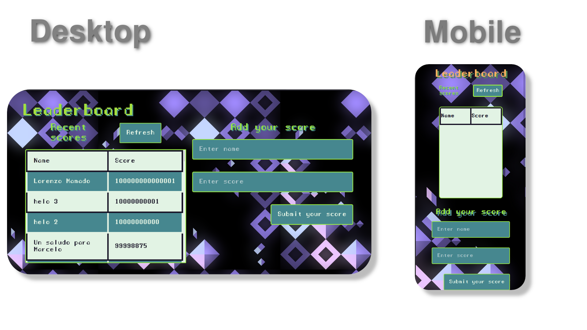

# Leaderboard
> Displays score of multiple participants

# Screenshots

## Built With

- 
- 
- 
- 

## Live Demo
You can see my page live here: 
[Check it out!](https://gabrielyea.github.io/leaderboard/)

## Getting Started
To get a local copy running follow this steps!
- Clone this repo.
- `npm install` to install the packages
- `npm run start` to build dist files and run local server.

### Run tests
To run the test just use the following command!
- `npm test`

<!--To get a local copy up and running follow these simple example steps.

### Prerequisites

### Setup

### Install

### Usage

### Deployment-->

## Authors

👤 *Gabriel Rendon*

- GitHub: [@gabrielyea](https://github.com/gabrielyea)

## 🤝 Contributing

Contributions, issues, and feature requests are welcome!

<!--Feel free to check the [issues page](../../issues/).-->

## Show your support

Give a ⭐️ if you like this project!

<!--## Acknowledgments-->

## 📝 License

This project is [MIT](./MIT.md) licensed.
